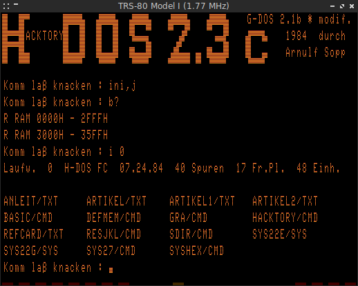
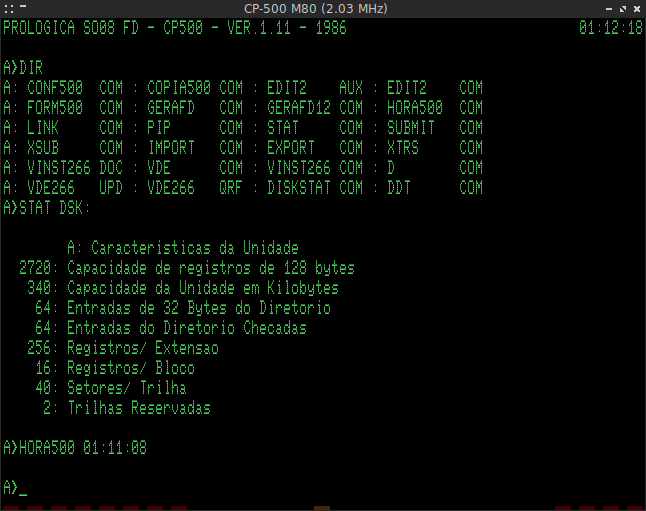
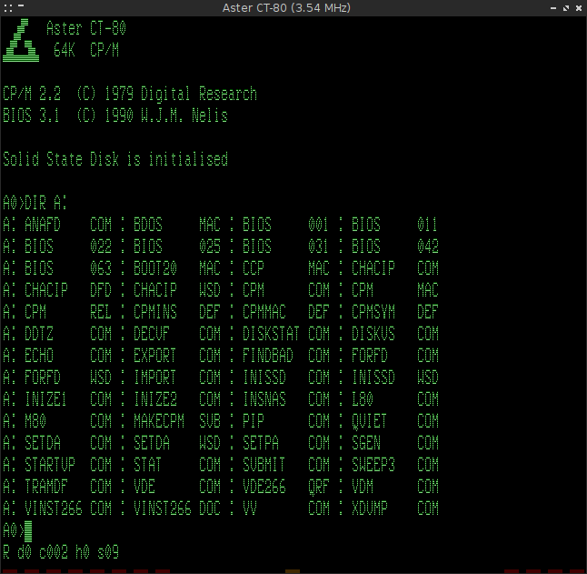
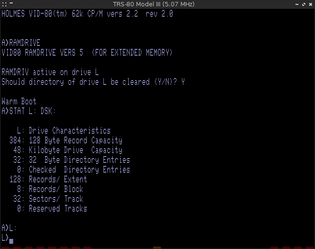
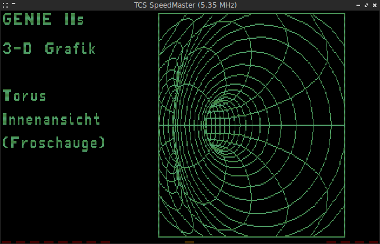
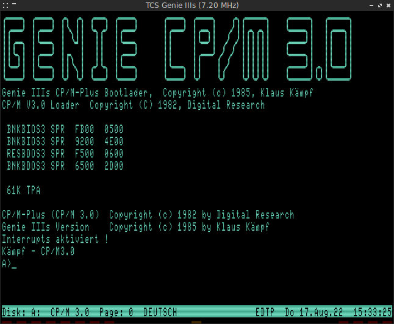

Updated version of Mark Grebe's [SDLTRS]:

  * Included all patches by [EtchedPixels]: banked memory support, Lowe LE18
  * Fixed various SegFaults: ROM Selection Menu, Scaling in Fullscreen
  * Reworked the TextGUI: new shortcuts and key bindings, help screen
  * Ctrl-A, Ctrl-C & Ctrl-V can now be used in the Emulator (CP/M & WordStar)
  * Display scanlines to simulate an old CRT monitor resolution
  * Access to real floppy disks works now on Linux
  * Fixed reported bugs to the original version
  * Port to SDL2 (see [BUILDING.md] and [SDL2])
  * Support Exatron Stringy Floppy for TRS-80 Model I
  * Select and execute CMD files directly in the Emulator
  * Save screenshot of the Emulator window as BMP file
  * Show Z80 registers in the window title bar
  * Adjust speed of Z80 CPU on the fly
  * Emulate Z80 memory refresh register
  * Support Holmes Sprinter II/III speed-up kits for TRS-80 Model I/III
  * Change Z80 CPU default MHz of each TRS-80 Model
  * More accurate emulation of Z80 block instructions
  * Joystick emulation with Mouse
  * Support Prologica CP-300/500 16 KB ROM with extra 2 KB Z80 monitor
  * Support Seatronics Super Speed-Up Board for all TRS-80 Models
  * Load and Save TRS-80 memory in debugger
  * Patch Model I ROM to boot from hard disk drive
  * Support EACA EG 3200 Genie III system
  * 480x192 HRG resolution for LNW80/II and TCS SpeedMaster/Genie IIs
  * CP/M banking support for TRS-80 Model I clones
  * Support EG-64 Memory-Banking-Adaptor from TCS
  * Support Lubomir Soft Banker for TRS-80 Model I
  * Emulation of the TCS Genie IIIs system
  * Support Schmidtke 80-Z Video Card for TRS-80 Model I
  * Emulate EG 3210 Programmable Graphics Adaptor for Genie III
  * Support some David Keil's TRS-80 Emulator extensions
  * Support Anitek MegaMem memory card for TRS-80 Model III and 4/4P
  * Emulate 4 MHz speedup hardware for TRS-80 Model III
  * Support TCS Genie IIs/SpeedMaster RAM 192 B memory expansion
  * Emulate 6845 CRTC Interlace Video Mode
  * Support VideoExtension HRG for EACA EG 3200 Genie III
  * Support Genieplus Memory Card for EACA EG 3200 Genie III
  * Support Prologica CP-500/M80 by Leonardo Brondani Schenkel
  * Emulate the [Aster CT-80] computer
  * Support 128/256/512/1024 bytes Sector Size for WD1000/1010
  * Support up to 8192 Hard Disk Cylinders
  * Modify addresses in ROM with debugger
  * Character sets of Aster CT-80, HT-1080Z and Meritum I
  * Support 5" / 8" disk size switch commands of Percom doubler
  * Select action for Z80 HALT instruction
  * Support 1024 KB memory for TCS Genie IIIs
  * Support 256/512/768/1024 KB memory for Alpha Technology SuperMem
  * Support Alpha Technology SuperMem for TRS-80 Model 4/4P
  * Emulate LNW80 Model II banking and 80x24 text mode
  * Emulate Real Time Clock/Calendar Card [RTCC] for TRS-80 Model I
  * Support Solid State Disk for Aster CT-80
  * Support 8 Disk Drives for TCS SpeedMaster/Genie IIs and IIIs
  * Emulate Holmes Engineering, Inc. VID-80 (VX-3) for TRS-80 Model III
  * Support 48 KB extended memory for Holmes VID-80 (VX-3)
  * Support Michael Wessel's Model I [X-MEM/80] 16K page memory extension

SDL(2)TRS is based on Tim Mann's excellent TRS-80 emulator [xtrs] and also
has very low system requirements: it works on all platforms supported by the
[SDL] library, even on machines with only a few hundred MHz of CPU speed.

  * [Documentation] online
  * [SDLTRS and the Video Genies] by Fritz Chwolka
  * [TCS Genie IIIs: A Legacy Computer System] by Egbert Schroeer
  * [Quick Getting Started guide] by Fred Jan Kraan

## License

  [BSD 2-Clause](LICENSE)

## Building
To build from the source code see [BUILDING.md].

## Contributing
All contributions are welcome.

## Binaries

  * [sdltrs.exe]     (32-bit, needs [SDL.DLL] of [SDL-1.2.14] for Win9X)
  * [sdl2trs.exe]    (32-bit, needs [SDL2.DLL])
  * [sdl2trs64.exe]  (64-bit, needs [SDL2.DLL])

(Release 1.2.34 build with [MinGW] & [MinGW-w64])

## Packages

  * [sdltrs_1.2.34-1_i386.deb]    (32-bit, SDL)
  * [sdl2trs_1.2.34-1_i386.deb]   (32-bit, SDL2)
  * [sdltrs_1.2.34-1_amd64.deb]   (64-bit, SDL)
  * [sdl2trs_1.2.34-1_amd64.deb]  (64-bit, SDL2)

(Build on Debian 9/i386 & Linux Mint 22.2/amd64)

  * Arch Linux: Thanks to Tércio Martins packages of
    [SDLTRS](https://aur.archlinux.org/packages/sdltrs) and
    [SDL2TRS](https://aur.archlinux.org/packages/sdl2trs)
    are available in [AUR].
  * Slackware: Thanks to B. Watson packages of
    [SDLTRS](https://slackbuilds.org/repository/15.0/system/sdltrs/) and
    [SDL2TRS](https://slackbuilds.org/repository/15.0/system/sdl2trs/)
    are available in [SlackBuilds].

## SDL2

The [SDL2] branch contains the SDL2 version with hardware rendering support.
SDL2 binaries and packages above are build on the [SDL2] branch.

The SDL2 version is available in [RetroPie] since version 4.6.6 and Valerio
Lupi's fork of [RetroPie-Setup] ...

## Forks

  * [SDLTRS-SH] with Mongoose web server for debugging by Sascha Häberling
  * [SDLTRS-TRS-IO] with integrated TRS-IO and FreHD by Arno Puder

## Screenshots

[Aster CT-80]: https://electrickery.nl/comp/trs80/aster/
[AUR]: https://aur.archlinux.org/
[BUILDING.md]: BUILDING.md
[Documentation]: https://jengun.gitlab.io/sdltrs
[EtchedPixels]: https://codeberg.org/EtchedPixels/xtrs
[MinGW]: https://sourceforge.net/projects/mingw/
[MinGW-w64]: http://mingw-w64.org
[RetroPie]: https://github.com/RetroPie
[RetroPie-Setup]: https://github.com/valerino/RetroPie-Setup
[RTCC]: https://electrickery.nl/comp/trs80/rtccc/
[SDL]: https://www.libsdl.org
[SDL2]: https://gitlab.com/jengun/sdltrs/-/tree/sdl2
[SDL.DLL]: https://www.libsdl.org/download-1.2.php
[SDL2.DLL]: https://github.com/libsdl-org/SDL/releases/tag/release-2.32.10
[SDL-1.2.14]: https://www.libsdl.org/release/SDL-1.2.14-win32.zip
[SDLTRS]: http://sdltrs.sourceforge.net
[SDLTRS and the Video Genies]: http://www.myoldc.info/eaca_tcs_computer/sdltrs_and_the_videogenies.html
[SDLTRS-SH]: https://github.com/shaeberling/sdltrs
[SDLTRS-TRS-IO]: https://github.com/apuder/sdltrs-trs-io
[sdltrs.exe]: bin/sdltrs.exe
[sdl2trs.exe]: bin/sdl2trs.exe
[sdl2trs64.exe]: bin/sdl2trs64.exe
[sdltrs_1.2.34-1_i386.deb]: bin/sdltrs_1.2.34-1_i386.deb
[sdl2trs_1.2.34-1_i386.deb]: bin/sdl2trs_1.2.34-1_i386.deb
[sdltrs_1.2.34-1_amd64.deb]: bin/sdltrs_1.2.34-1_amd64.deb
[sdl2trs_1.2.34-1_amd64.deb]: bin/sdl2trs_1.2.34-1_amd64.deb
[SlackBuilds]: http://slackbuilds.org/
[TCS Genie IIIs: A Legacy Computer System]: https://github.com/Egbert-Azure/GenieIIIs
[Quick Getting Started guide]: https://electrickery.nl/comp/trs80/sdltrs_qrg.html
[X-MEM/80]: https://github.com/lambdamikel/x-mem-80
[xtrs]: https://www.tim-mann.org/xtrs.html
